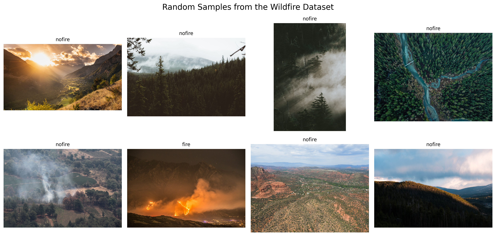
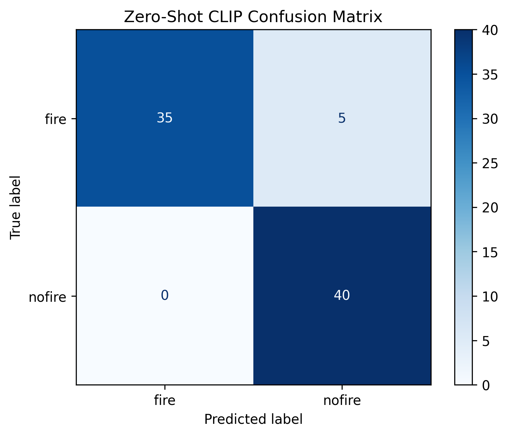
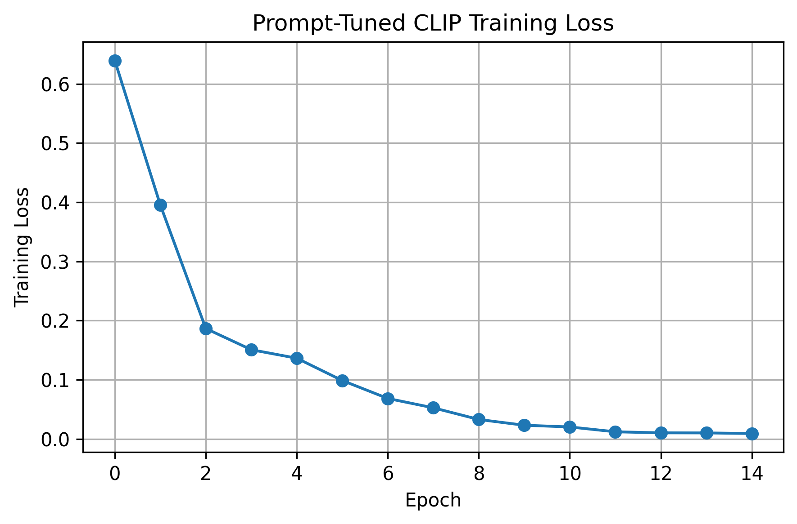
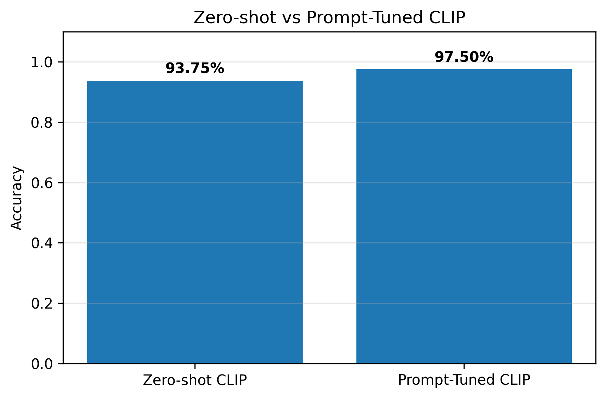
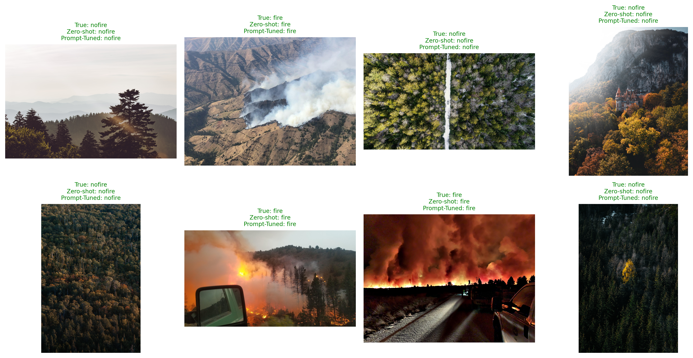

# Wildfire Classification with CLIP: Zero-Shot vs Prompt Tuning

A lightweight research prototype that evaluates the performance of OpenAI's CLIP model for **wildfire image classification**. The project compares **Zero-Shot CLIP** against **Prompt-Tuned CLIP**, where only a small set of learnable prompt vectors is optimized while keeping the entire CLIP model frozen.

---

## Project Overview

This project investigates whether **prompt tuning** can improve wildfire classification without fine-tuning the entire CLIP model.

Two approaches are compared:

- **Zero-Shot CLIP**
  - Uses manually written text prompts.
  - No training is performed.

- **Prompt-Tuned CLIP**
  - Learns a small number of prompt vectors.
  - CLIP image and text encoders remain frozen.
  - Only **4,096 parameters** are trained.

---

## Dataset

**Dataset:** The Wildfire Dataset

- Source: Kaggle
- Images: 2,699
- Classes:
  - Fire
  - No Fire

For this prototype:

- Training Images: **120**
- Testing Images: **80**

---

##  Model

- Backbone: **OpenAI CLIP ViT-B/32**
- Framework: PyTorch
- Prompt Length: **8 Context Tokens**
- Trainable Parameters: **4,096**
- Frozen Parameters: **151,277,313**
- Optimizer: AdamW
- Epochs: **15**

---

# Results

| Method | Accuracy |
|---------|----------|
| Zero-Shot CLIP | **93.75%** |
| Prompt-Tuned CLIP | **97.50%** |

**Accuracy Improvement:** **+3.75%**

---

# Figures

## 1. Sample Images



---

## 2. Zero-Shot Confusion Matrix



---

## 3. Prompt Tuning Training Loss



---

## 4. Accuracy Comparison



---

## 5. Qualitative Prediction Examples



#  How to Run

Clone the repository:

```bash
git clone https://github.com/USERNAME/WILDFIRE_CLIP_PROJECT.git
```

Install dependencies:

```bash
pip install torch torchvision transformers kagglehub matplotlib scikit-learn pillow
```

Open the notebook:

```
Wildfire_Classification_with_CLIP.ipynb
```

Run all cells sequentially.

---

# 📦 Requirements

- Python 3.10+
- PyTorch
- Transformers
- torchvision
- kagglehub
- matplotlib
- scikit-learn
- Pillow

